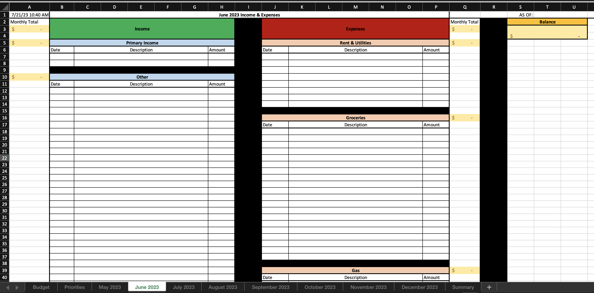
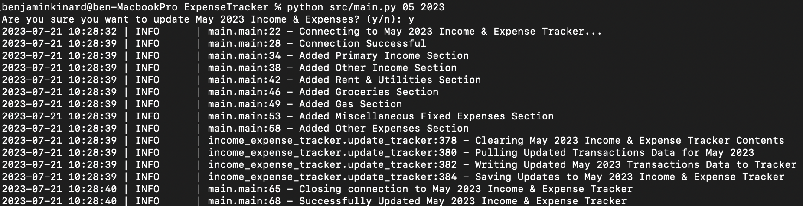
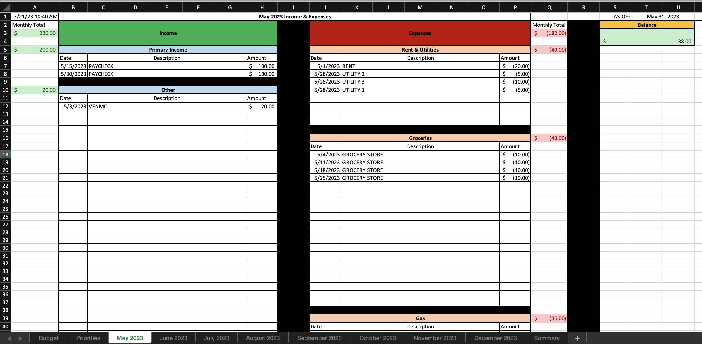

# ExpenseTracker :moneybag:



## About :mag:
This repository hosts a personal project of mine to automate the process of tracking and categorizing the transactions 
that occur within my primary checking account each month. When run, the sheet corresponding to the specified month in 
the Microsoft Excel workbook displayed above will fill the various income and expense categories with transactions from 
the entire month (or from the beginning of the month to the current date, if run during the month of interest). By 
automating this process, I can efficiently view how my expenses compare to my income, as well as where my money is 
being spent, as often as I would like.

## Run :running:
To run the program, simply execute the following command from the project root directory:

```sh
python src/main.py mm YYYY
```

where `mm` is the two-digit code representing the target month and `YYYY` is the four-digit target year.

The program will ask you to confirm you want to update the tracker for the month and year specified. Once confirmation 
is received, the program will update the tracker with the latest transaction data for the period. A successful run will 
look like the following:



Navigate to the month's corresponding sheet, and you will see results like this:



## Future Improvements :hammer:
Currently, access to my bank's APIs is only permitted to businesses with a signed contractual agreement. Should they 
ever make this access available to individual customers for personal use in projects such as this one, then I intend to 
implement the `APITransactionDAO` class as found in `src/transaction/dao/transaction_dao.py` to further improve the 
automation of this process.